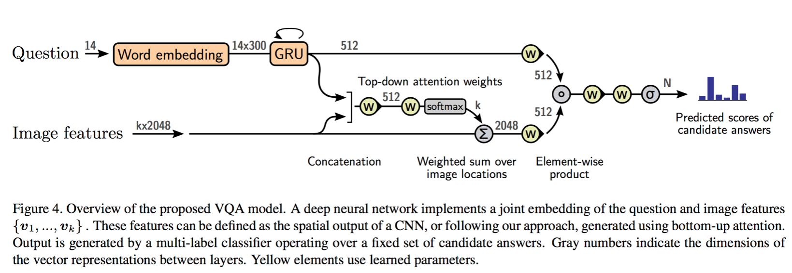
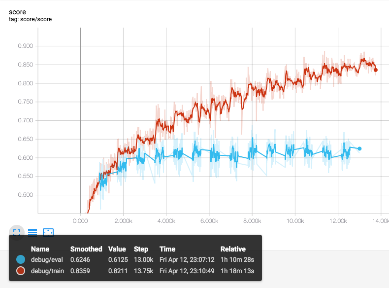

## Bottom-Up and Top-Down Attention for Visual Question Answering

An tensorflow implementation of the winning entry of the [2017 VQA Challenge](http://www.visualqa.org/challenge.html).
The model details are in "Tips and Tricks for Visual
Question Answering: Learnings from the 2017 Challenge"
[paper](https://arxiv.org/abs/1708.02711).  
This implementation is motivated from pytorch implementation [link](https://github.com/hengyuan-hu/bottom-up-attention-vqa).

## Some Info.
- This code do **not** use visual-genome dataset fore pretraining.
- More number of hidden neurons are used than original paper (512 >> 1024)  
- batch normalization is used in classifier.
- This implementation requires large RAM size (~ 100 GB) by pretrained features.


## Results
I checked the final results and it can be differ whether early-stopping is used.  

| Model | Validation Accuracy | Training Time
| --- | --- | -- |
| Reported Model | 63.15 | 12 - 18 hours (Tesla K40) |
| TF Model | **61~64** | < 1 hours (Tesla P40) |

## Model Architecture
### Proposed Model (in paper)


### Implemented Graph (tensorboard) 


### Learning curve (score)



## Main Codes
* ./dataset.py : data preprocessing and tensorflow dataset modules.
* ./models/ops.py : tensorflow operation warpper.
* ./models/vqa_model.py : model class
* ./models/language_model.py : word embedding and question embedding
* ./models/top_down_attention.py : proposed top-down-attention module

## Prerequisites
Make sure you are on a machine with a NVIDIA GPU and Python 3 with about **100 GB RAM space**.  
This code needs more memory than pytorch version (70~80 GB).  
Some issues are resolving to increase memory efficiency.  
If you resolve, i always welcome PR.  
```
- tensorflow 1.13.0
- h5py
```

## Data Setup
Data download and preprocessing module is from [original_repo](https://github.com/peteanderson80/bottom-up-attention) and [pytorch_repo]((https://github.com/hengyuan-hu/bottom-up-attention-vqa)

Make sure your dataset should be downloaded to `./data/` directory.
```
>> mkdir data
>> sh tools/download.sh
>> sh tools/process.sh
```

## Run
For various hyperparameter setting, refer the arguments in `main.py`.
```
>> python main.py
```

If you want to visualize your result and graph
```
>> tensorboard --logdir='./tensorboard' (--ip=YOUR_IP) (--port=YOUR_PORT)
```

## Early stopping
Evaluation on validation data is available at every epoch.   
Also early-stpping is enable to prevent from overfitting.  
However, because of memory issue, the code in `main.py` is annotated.

## Reference
- "Tips and Tricks for Visual
Question Answering: Learnings from the 2017 Challenge"
[paper](https://arxiv.org/abs/1708.02711).  
- pytorch implementation of [hengyuan-hu](https://github.com/hengyuan-hu) [link](https://github.com/hengyuan-hu/bottom-up-attention-vqa)  
